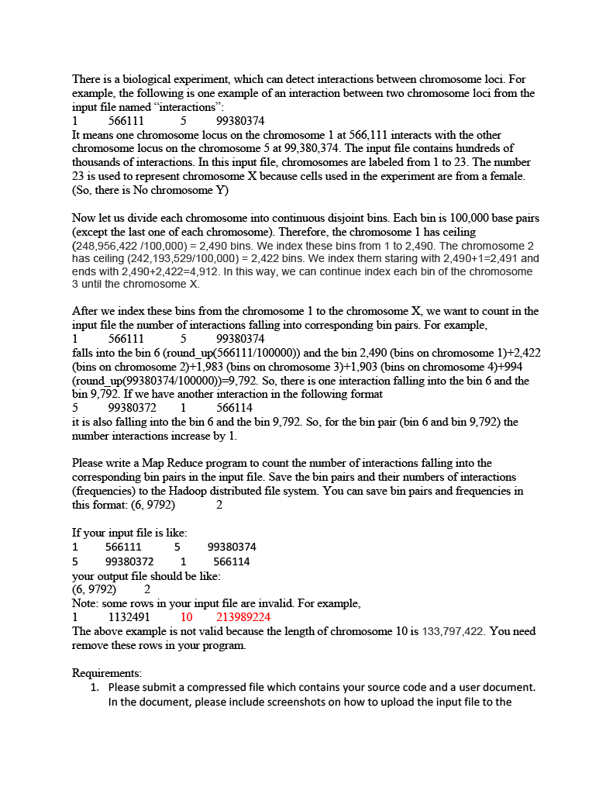
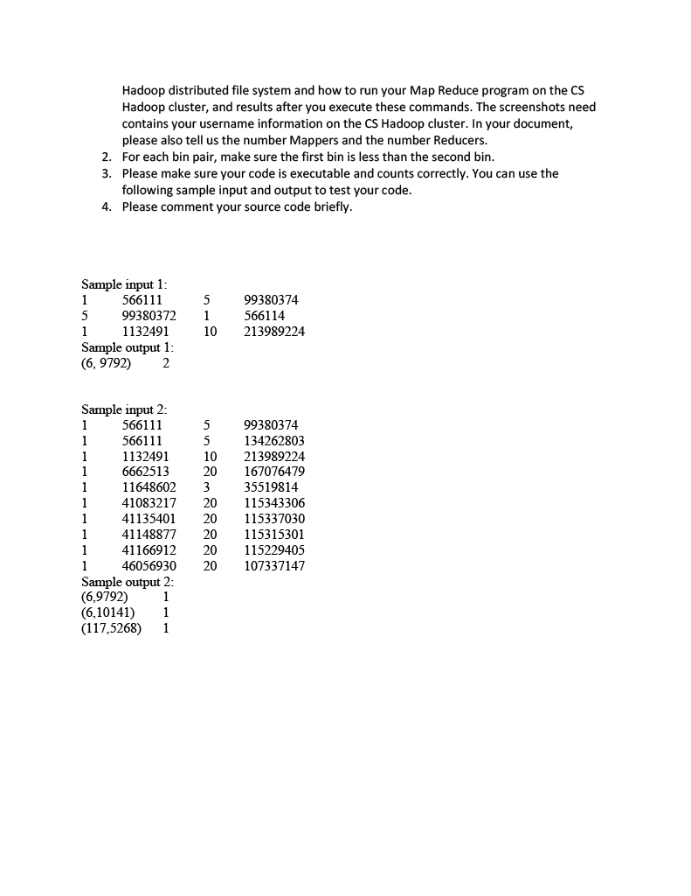

# CSCI-455-Project-3


# These are the requirements for the project
<p align="center">
  
</p>

<p align="center">
  
</p>

<p align="center">
  
</p>

# How to run

In order to run this you have to have a Hadoop server running.
In this case I'll be using the Hadoop server that NDSU has called zoidberg.cs.ndsu.nodak.edu.

### Uploading files
Once you have that you'll need to upload the java files and the input file to the server. To do that you can use either [FileZilla](https://filezilla-project.org/) or [WinSCP](https://winscp.net/eng/index.php) to connect to the server through SFTP

### Setup
Once you transfer the files over you now need to compile the files.

To do this you'll need to run this command `hadoop com.sun.tools.javac.Main Hadoop.java DataMapper.java DataReducer.java Table.java`[^1]

[^1]: If you get a reponse that looks like this 
```text Noted: Note: Table.java uses unchecked or unsafe operations```

Doing this will produce the class files for each java file.

Next you'll need to run this command `jar cf Hadoop.jar Hadoop*.class DataMapper*.class DataReducer*.class Table*.class`

Running this command will then create the jar file we to run the program.

Now that we have the jar file we can now run the program. But first we'll need to transfer the input file to the HDFS (Hadoop Distributed File System)
